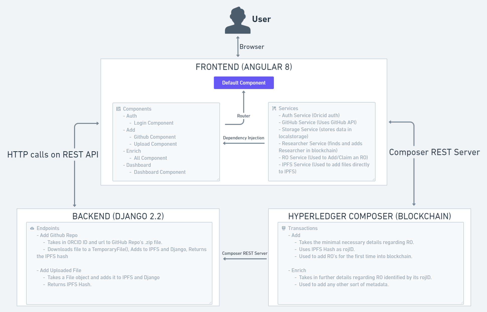

# Google Summer of Code - Open Bioinformatics Foundation

> Project proposal that I submitted can be found here : https://docs.google.com/document/d/1Yb00tzktVDoX52J83C6ueSJKw5UGDyfgfMGhg4ydlFA/edit?usp=sharing 

# The final architecture of Journal of Research Objects can be seen here :

## Milestones Achieved

### JRO Business Network Application
This part involved coding Add and Enrich transactions which will be used to add RO's into blockchain and to enrich them with specific "Metadata". These transactions were also linked with respective Wallet events.

The following commits were made by me into this repo :
- [41efd9bd9eda8a6709f1da0bf29164af933db310](https://github.com/Blockchain4openscience/jroBna/commit/41efd9bd9eda8a6709f1da0bf29164af933db310)
- [ea3f5ded44147492ee285854e05e856268c7d3e6](https://github.com/Blockchain4openscience/jroBna/commit/ea3f5ded44147492ee285854e05e856268c7d3e6)
- [fc82ec8a45ff1934468338de2e6c183a4c8f0c3f](https://github.com/Blockchain4openscience/jroBna/commit/fc82ec8a45ff1934468338de2e6c183a4c8f0c3f)
- [5e25cc5910bb28c556f3b99fe69ce6818c0f5e27](https://github.com/Blockchain4openscience/jroBna/commit/5e25cc5910bb28c556f3b99fe69ce6818c0f5e27)
- [97459c56915be5bcc07bc716bd092b2068ee5b33](https://github.com/Blockchain4openscience/jroBna/commit/97459c56915be5bcc07bc716bd092b2068ee5b33)
- [36c7f89fa90d839c38e406d069235a7eb78ce932](https://github.com/Blockchain4openscience/jroBna/commit/36c7f89fa90d839c38e406d069235a7eb78ce932)
- [c972a970f2dfb4c6d5a406b93041dd70e20fbbb6](https://github.com/Blockchain4openscience/jroBna/commit/c972a970f2dfb4c6d5a406b93041dd70e20fbbb6)
- [2606cf63b77e7b3530245236f562443c456b7481](https://github.com/Blockchain4openscience/jroBna/commit/2606cf63b77e7b3530245236f562443c456b7481)
- [cea5f09919ee804a1721538deca742e855f6fcac](https://github.com/Blockchain4openscience/jroBna/commit/cea5f09919ee804a1721538deca742e855f6fcac)

### IPFS-Hyperledger integration using Python
This part involved protoyping the use of Python to link IPFS and Hyperledger. This implementation was successfull and further was implemented in JRO Backend. All the work into this repository was done by me, commits can be viewed here : https://github.com/Blockchain4openscience/IPFS-Hyperledger-Integration/commits/master

### JRO Frontend
This was the most challenging part of the entire project. Frontend was made using Angular 8 and is built atop CoreUI design system. All the work into this repository was done by me, commits can be viewed here : https://github.com/bangpradyumna/Journal-Of-Research-Objects-Frontend/commits/master

Work that is done :
- Basic frontend with authentication, adding RO using github, adding RO by uploading are working.
- Services that interact with Github, IPFS, Blockchain and Django are properly configured and can be reused.

Works that needs to be done :
- Authentication curently makes a large use of LocalStorage which is not very secure. Authentication needs to be moved to Django (i.e Backend) preferably using JWT (http://jwt.io). If this is done, all the endpoints need to be secured using this so that only authenticated users are able to use this service.
- Dashboard is pretty empty at the moment and I could not make the cards functional. Dashboard must be populated as new features roll-in.
- Route guards need to be properly implemented.

### JRO Backend
This part handles most of the functionality off the application like adding files to IPFS, storing them in db etc. All the work into this repository was done by me, commits can be viewed here : https://github.com/bangpradyumna/JROBackend/commits/master

Work that is done : 
- Endpoint for adding uploaded files to IPFS is complete. 
- Endpoint for downloading a github repo into a temp file, adding it to IPFS and returning hash is complete.

Work that needs to be done:
- As mentioned before, More of the authentication part should be moved over to backend.
- Better error handling for the project is required. All use cases need to be covered and tests need to be written.

### JRO Docs
This is documentation that covers entire work done into Journal of Research Objects by me. This includes installation, structure and architecture of application. The documentation was generated using [docsify](https://docsify.js.org/).

Work that needs to be done: 
Currently the docs don't cover alot of smaller parts and functions of the application. This was not possible due to time constraint, Certainly more work can be utilized over here.

# Final Comments
This projected was a great learning experience for me. 
I learnt what blockchain is, how it works, its limitations;
I learnt what decentralized web means, how is be being developed, how useful it is in todays context and how can it be integrated into any application; 
I further improved my knowledge in JS and was able to pick up Angular despite having no prior experience in it. This was the most important part of my project;

Above all, I learnt about the problem of Reproducibility faced by the entire scientific community over the world and I'm proud to have contributed to a project that involves solving this very problem.

To Open, Decentralized and Reproducible Science!